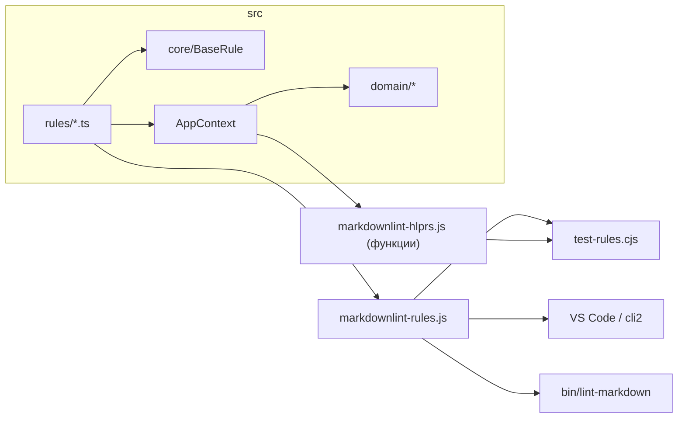

# markdownlint-custom

## Обзор

Кастомные правила [markdownlint](https://github.com/DavidAnson/markdownlint) для VS Code (**vscode-markdownlint**) и локального CLI (**markdownlint-cli2**). Единый конфиг — [`.markdownlint-cli2.jsonc`](.markdownlint-cli2.jsonc) (built-in MD001–MD060 + custom rules).

Исходники — TypeScript в [`src/`](src/); runtime для markdownlint — CommonJS [`.js`](markdownlint-rules.js) в корне репозитория. Entry points: [`markdownlint-rules.js`](markdownlint-rules.js) (правила), [`markdownlint-hlprs.js`](markdownlint-hlprs.js) (compat для тестов).

## Требования

- Node.js ≥ 22 ([`.nvmrc`](.nvmrc), `engines` в [`package.json`](package.json)); [`.npmrc`](.npmrc) — `engine-strict=true`;
- VS Code + расширение **vscode-markdownlint** (или другое с поддержкой `.markdownlint-cli2.jsonc`);
- [`.editorconfig`](.editorconfig) — единый LF и отступ 4 пробела в редакторах с поддержкой EditorConfig;

## Переносы строк (LF)

Репозиторий и рабочие копии — LF ([`.gitattributes`](.gitattributes), [`.editorconfig`](.editorconfig)). Это важно для regex-правил markdownlint и примеров в [`markdownlint-examples/`](markdownlint-examples/).

**Windows:** рекомендуется `git config core.autocrlf false` (глобально или локально для репозитория), чтобы Git не конвертировал LF↔CRLF поверх `.gitattributes` и не создавал шум в `git diff`.

VS Code: `"files.eol": "\n"` в `.vscode/settings.json` (локально; каталог `.vscode/` в [`.gitignore`](.gitignore)).

## Быстрый старт

```bash
npm install
npm test        # pretest → build, test-rules + test-cli2-config + check-function-order
```

## Локальная проверка без IDE

Точки входа, bootstrap, guard без пути — [`.cursor/rules/platform-scripts.mdc`](.cursor/rules/platform-scripts.mdc) (Claude: [`.claude/rules/platform-scripts.md`](.claude/rules/platform-scripts.md)).

Примеры команд (`--help`, passthrough `-- <cli2 args>` — см. [`.cursor/rules/platform-scripts.mdc`](.cursor/rules/platform-scripts.mdc) / [`.claude/rules/platform-scripts.md`](.claude/rules/platform-scripts.md)):

```bash
npm run lint:md -- ./path/to/docs
./bin/lint-markdown.sh ./path/to/docs         # Linux / WSL / macOS
./bin/lint-markdown.command ./path/to/docs    # macOS Finder
bin\lint-markdown.bat .\path\to\docs          # Windows CMD
```

В IDE lint весь markdown workspace (кроме `node_modules`, `vendor`). Внешняя документация — `npm run lint:md -- <path>`; конфиг и custom rules — из корня этого репозитория. macOS Finder: drag-and-drop на `bin/lint-markdown.command`.

Конфиг — [`.markdownlint-cli2.jsonc`](.markdownlint-cli2.jsonc). Built-in: `default: true`; намеренные overrides — таблица в [`.cursor/rules/markdownlint-project.mdc`](.cursor/rules/markdownlint-project.mdc) / [`.claude/rules/markdownlint-project.md`](.claude/rules/markdownlint-project.md) (`MD013`, `MD007`, `MD029`, `MD032`, `MD043`, `MD046`).

### Исключение папок из lint (`.markdownlint-ignore`)

[`.markdownlint-ignore`](.markdownlint-ignore) — gitignore-синтаксис (комментарии `#`, пустые строки игнорируются, glob-паттерны от корня репозитория). Читает сам `markdownlint-cli2` (top-level `gitignore` в `.markdownlint-cli2.jsonc`) — работает одинаково в VS Code и в CLI.

### VS Code для markdown

Рекомендуемые настройки `[markdown]` — в [`.cursor/rules/markdownlint-project.mdc`](.cursor/rules/markdownlint-project.mdc) / [`.claude/rules/markdownlint-project.md`](.claude/rules/markdownlint-project.md) (раздел IDE и EditorConfig).

## Подключение в VS Code

См. [`.cursor/rules/markdownlint-project.mdc`](.cursor/rules/markdownlint-project.mdc) / [`.claude/rules/markdownlint-project.md`](.claude/rules/markdownlint-project.md) (раздел «Подключение в VS Code»).

## Правила проверки

Кастомные правила markdownlint для оформления Markdown-документов. Примеры нарушений и исправлений — в [`markdownlint-examples/<rule-name>/`](markdownlint-examples/).

| `names` | Что проверяет |
| --- | --- |
| `minimum-h2-heading` | В документе есть хотя бы один заголовок H2 (`##` или setext) вне code fence |
| `list-items-end-with-semicolon-or-colon` | Пункт списка (num/bul, вложенные) заканчивается `;`; перед открывающей `` ``` `` или прямым дочерним пунктом — `:`; конец тела через `findListItemBodyEnd` |
| `list-blank-line-spacing` | Нумерованные списки: пустая строка до первого и после последнего пункта блока (EOF skip, same-kind skip), единообразно между соседними `listItemPrefix` в ordered subtree (вложенные bul/num); маркированные: пустая строка только до/после блока (между пунктами не проверяется); blank после `##` перед списком обязателен |
| `list-preceded-by-colon` | Обычный текст (не пункт списка) перед первым пунктом блока верхнего уровня (num/bul) заканчивается `:`; skip prev: заголовок, пункт списка, code fence, pipe-таблица; вложенные не проверяются |
| `codeblock-preceded-by-colon` | Строка перед открывающей `` ``` `` (не пункт списка) заканчивается `:`; skip prev: заголовок, пункт списка, code fence, pipe-таблица |
| `no-leading-spaces` | Нет ведущих пробелов у обычного текста, пунктов списка верхнего уровня и строк `` ``` ``; у вложенных пунктов отступ допустим, если не меньше отступа предыдущего пункта; первый вложенный пункт блока без предыдущего sibling — ошибка |
| `sentences-end-with-mark` | Обычный текст (не заголовок, blockquote и продолжения, HR, пункт списка, pipe-таблица) заканчивается `.`, `!`, `?`, `:` или `;` |

Проверки выполняются вне содержимого code fence, кроме строк-обозначений `` ``` `` (для `no-leading-spaces`). Вложенные нумерованные списки: **3 пробела** на уровень, маркер **`1.`** (CommonMark); не использовать поднумерацию `1.1` в маркере.

## Структура репозитория

| Путь | Назначение |
| --- | --- |
| [`src/`](src/) | Исходники TypeScript (`core/`, `domain/`, `composition/`, `rules/`) |
| Корневые `*.js`, `core/`, `domain/`, `composition/`, `rules/` | **Артефакты tsc** — коммитить вместе с `src/` |
| [`markdownlint-examples/`](markdownlint-examples/) | Пары `_err.md` / `_suc.md` на каждое правило |
| [`test-rules.cjs`](test-rules.cjs), [`test-cli2-config.cjs`](test-cli2-config.cjs), [`test-markdownlint-ignore.cjs`](test-markdownlint-ignore.cjs), [`check-function-order.cjs`](check-function-order.cjs) | Тесты, проверка cli2-конфига и игнор-файла, порядок функций |
| [`markdownlint-hlprs.js`](markdownlint-hlprs.js) | Compat API для `test-rules.cjs` |
| [`package.json`](package.json), [`tsconfig.json`](tsconfig.json) | npm-скрипты, сборка tsc |
| [`.markdownlint-cli2.jsonc`](.markdownlint-cli2.jsonc), [`.markdownlint-ignore`](.markdownlint-ignore), [`load-cli2-config.cjs`](load-cli2-config.cjs) | Единый конфиг lint, игнор-файл (папки вне lint); загрузчик для test |
| [`bin/`](bin/) | CLI: `lint-markdown.cjs`, `.sh` / `.bat` / `.command` |
| [`schema/`](schema/) | Snapshot [official schema](https://github.com/DavidAnson/markdownlint/blob/main/schema/.markdownlint.jsonc) для `test-cli2-config.cjs` |
| [`scripts/`](scripts/) | `sync-cli2-config.cjs`, `cli2-overrides.cjs` — регенерация cli2 из schema + overrides + custom keys |
| [`.cursor/rules/`](.cursor/rules/) | Правила Cursor; каталог — [`AGENTS.md`](AGENTS.md) |
| [`.claude/rules/`](.claude/rules/), [`CLAUDE.md`](CLAUDE.md) | Правила Claude Code (эквивалент `.cursor/rules/`); каталог — [`AGENTS.md`](AGENTS.md) |
| `.gitignore`, `.gitattributes`, `.editorconfig`, `.nvmrc`, `.npmrc` | Git, EditorConfig, Node/npm (подробнее в правилах) |
| [`AGENTS.md`](AGENTS.md) | Краткий справочник для AI-агента |

Подробная структура — [`.cursor/rules/markdownlint-project.mdc`](.cursor/rules/markdownlint-project.mdc) (Claude: [`.claude/rules/markdownlint-project.md`](.claude/rules/markdownlint-project.md)).

## Архитектура

Каждое правило — класс `XxxRule extends BaseRule`: **3** правила с `parser: "micromark"` (`checkMicromark`, tokens AST); **4** — `parser: "none"` (`check()`, только `params.lines[]`). Domain-сервисы сообщают нарушения через `onError`; `toRule()` адаптирует класс к API markdownlint.

Зависимости (парсер списков, обход code fence, checker-ы) собираются в [`AppContext`](src/composition/app-context.ts). [`markdownlint-rules.ts`](src/markdownlint-rules.ts) регистрирует все правила; [`markdownlint-hlprs.js`](markdownlint-hlprs.js) — compat-слой для [`test-rules.cjs`](test-rules.cjs).

Схема:



## npm-скрипты

| Скрипт | Действие |
| --- | --- |
| `npm run build` | `tsc`: `src/` → корень |
| `npm test` | `pretest` (build) + `test-rules.cjs` + `test-cli2-config.cjs` + `test-markdownlint-ignore.cjs` + `check-function-order.cjs` (cli2 parity — только здесь) |
| `npm run lint:md` | Локальный lint папки/файла (bootstrap в runner); несколько файлов: `lint:md -- file1.md file2.md` |
| `npm run sync:cli2-config` | Регенерация `.markdownlint-cli2.jsonc` из schema + overrides + custom keys из `markdownlint-rules.js` + `globs` + `gitignore` (`presync:cli2-config` → build). При bump `markdownlint` — обновить `schema/` (см. `.mdc`) |
| `npm run check` | `precheck` (build) + `tsc --noEmit` + `node --check` на 10 `.js`/`.cjs` + порядок функций (без запуска `test-cli2-config`) |
| `npm run check:order` | Только проверка порядка функций |

## Разработка и тестирование

Workflow — [`AGENTS.md`](AGENTS.md) (шаги 1–8). Кратко: правки → при новом/удалённом правиле `npm run sync:cli2-config` → `npm test` → sync docs по [`.cursor/rules/docs-consistency.mdc`](.cursor/rules/docs-consistency.mdc) / [`.claude/rules/docs-consistency.md`](.claude/rules/docs-consistency.md).

Runtime — CommonJS `.js`, не `.ts` и не ESM.

## Связанная документация

- [`AGENTS.md`](AGENTS.md) — краткий справочник для AI-агента, workflow;
- [`CLAUDE.md`](CLAUDE.md) — точка входа для Claude Code (эквивалент `.cursor/rules/` для Claude);
- [`.cursor/rules/markdownlint-project.mdc`](.cursor/rules/markdownlint-project.mdc) / [`.claude/rules/markdownlint-project.md`](.claude/rules/markdownlint-project.md) — полные политики lint-правил, `.markdownlint-cli2.jsonc`, CLI;
- [`.cursor/rules/platform-scripts.mdc`](.cursor/rules/platform-scripts.mdc) / [`.claude/rules/platform-scripts.md`](.claude/rules/platform-scripts.md) — bin-скрипты, bootstrap в runner (`node_modules`, stale build);
- [`.cursor/rules/docs-consistency.mdc`](.cursor/rules/docs-consistency.mdc) / [`.claude/rules/docs-consistency.md`](.claude/rules/docs-consistency.md) — синхронизация кода и документации;
- [markdownlint: Custom Rules](https://github.com/DavidAnson/markdownlint/blob/main/doc/CustomRules.md) — официальная документация;
