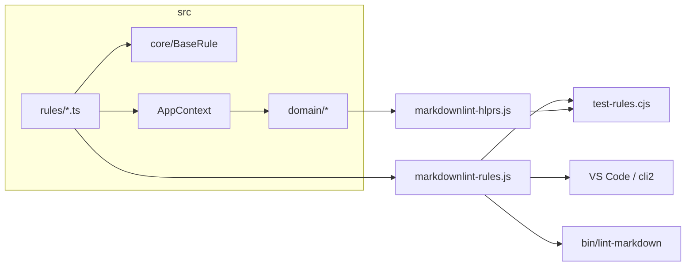

# markdownlint-custom

Кастомные правила [markdownlint](https://github.com/DavidAnson/markdownlint) для VS Code (**vscode-markdownlint**) и локального CLI (**markdownlint-cli2**). Единый конфиг — [`.markdownlint-cli2.jsonc`](.markdownlint-cli2.jsonc) (built-in MD001–MD060 + custom rules).

Исходники — TypeScript в [`src/`](src/); runtime для markdownlint — CommonJS [`.js`](markdownlint-rules.js) в корне репозитория. Entry points: [`markdownlint-rules.js`](markdownlint-rules.js) (правила), [`markdownlint-hlprs.js`](markdownlint-hlprs.js) (compat для тестов).

## Требования

- Node.js ≥ 22 ([`.nvmrc`](.nvmrc), `engines` в [`package.json`](package.json)); [`.npmrc`](.npmrc) — `engine-strict=true`
- VS Code + расширение **vscode-markdownlint** (или другое с поддержкой `.markdownlint-cli2.jsonc`)
- [`.editorconfig`](.editorconfig) — единый LF и отступ 4 пробела в редакторах с поддержкой EditorConfig

## Переносы строк (LF)

Репозиторий и рабочие копии — LF ([`.gitattributes`](.gitattributes), [`.editorconfig`](.editorconfig)). Это важно для regex-правил markdownlint и примеров в [`markdownlint-examples/`](markdownlint-examples/).

**Windows:** рекомендуется `git config core.autocrlf false` (глобально или локально для репозитория), чтобы Git не конвертировал LF↔CRLF поверх `.gitattributes` и не создавал шум в `git diff`.

VS Code: `"files.eol": "\n"` в `.vscode/settings.json` (локально; каталог `.vscode/` в [`.gitignore`](.gitignore)).

## Быстрый старт

```bash
npm install
npm test        # pretest → build, test-rules + test-cli2-config + check-function-order
```

## Локальная проверка без IDE

Bootstrap в [`bin/lint-markdown.cjs`](bin/lint-markdown.cjs) — см. [`.cursor/rules/platform-scripts.mdc`](.cursor/rules/platform-scripts.mdc). Через `npm run lint:md` дополнительно срабатывает `prelint:md`.

```bash
npm run lint:md -- ./path/to/docs
```

Правила для **папок с пользовательской документацией**. Meta-файлы репозитория (`README.md`, `AGENTS.md`, `.cursor/**`) исключены через `ignores` в [`.markdownlint-cli2.jsonc`](.markdownlint-cli2.jsonc).

```bash
# Linux / WSL / macOS
./bin/lint-markdown.sh /path/to/docs

# Windows CMD
bin\lint-markdown.bat C:\path\to\docs

# macOS (Finder)
open bin/lint-markdown.command
```

Конфиг — [`.markdownlint-cli2.jsonc`](.markdownlint-cli2.jsonc). Built-in: `default: true`; намеренные overrides — таблица в [`.cursor/rules/markdownlint-project.mdc`](.cursor/rules/markdownlint-project.mdc) (`MD013`, `MD007`, `MD029`, `MD032`, `MD043`, `MD046`).

### VS Code для markdown

Рекомендуемые настройки `[markdown]` — в [`.cursor/rules/markdownlint-project.mdc`](.cursor/rules/markdownlint-project.mdc) (раздел IDE и EditorConfig): `tabSize: 4`, `wordWrap`, `insertFinalNewline`, `trimTrailingWhitespace: false`.

## Подключение в VS Code

Достаточно [`.markdownlint-cli2.jsonc`](.markdownlint-cli2.jsonc) в корне workspace — расширение подхватит его автоматически. Ручной `markdownlint.config` и `markdownlint.customRules` в settings **не нужны**, если файл в корне.

Опционально (файл не в корне): `"markdownlint.configFile": "./.markdownlint-cli2.jsonc"`.

## Правила проверки

Кастомные правила markdownlint для оформления Markdown-документов. Примеры нарушений и исправлений — в [`markdownlint-examples/<rule-name>/`](markdownlint-examples/).

| `names` | Что проверяет |
|---------|---------------|
| `minimum-h2-heading` | В документе есть хотя бы один заголовок H2 (`##`) вне code fence |
| `list-items-end-with-semicolon-or-colon` | Пункт списка (num/bul, вложенные) заканчивается `;`; перед блоком кода или прямым дочерним пунктом — `:` |
| `list-blank-line-spacing` | Нумерованные списки: пустая строка до первого и после последнего пункта блока (EOF skip, same-kind skip), единообразно между соседними num-пунктами (включая поднумерацию `1.1`, `1.1.1`); маркированные: пустая строка только до/после блока |
| `list-preceded-by-colon` | Обычный текст (не пункт списка) перед первым пунктом блока верхнего уровня (num/bul) заканчивается `:`; skip prev: заголовок, пункт списка, code fence; вложенные не проверяются |
| `codeblock-preceded-by-colon` | Строка перед открывающей `` ``` `` (не пункт списка) заканчивается `:`; skip prev: заголовок, пункт списка, code fence |
| `no-leading-spaces` | Нет ведущих пробелов у обычного текста, пунктов списка верхнего уровня и строк `` ``` ``; у вложенных пунктов отступ допустим, если не меньше отступа предыдущего пункта |
| `sentences-end-with-mark` | Обычный текст (не заголовок, blockquote, HR, не пункт списка) заканчивается `.`, `!`, `?`, `:` или `;` |

Проверки выполняются вне содержимого code fence, кроме строк-обозначений `` ``` `` (для `no-leading-spaces`).

## Структура репозитория

| Путь | Назначение |
|------|------------|
| [`src/`](src/) | Исходники TypeScript (`core/`, `domain/`, `composition/`, `rules/`) |
| Корневые `*.js`, `core/`, `domain/`, `composition/`, `rules/` | **Артефакты tsc** — коммитить вместе с `src/` |
| [`markdownlint-examples/`](markdownlint-examples/) | Пары `_err.md` / `_suc.md` на каждое правило |
| [`test-rules.cjs`](test-rules.cjs), [`test-cli2-config.cjs`](test-cli2-config.cjs), [`check-function-order.cjs`](check-function-order.cjs) | Тесты, проверка cli2-конфига, порядок функций |
| [`markdownlint-hlprs.js`](markdownlint-hlprs.js) | Compat API для `test-rules.cjs` |
| [`package.json`](package.json), [`tsconfig.json`](tsconfig.json) | npm-скрипты, сборка tsc |
| [`.markdownlint-cli2.jsonc`](.markdownlint-cli2.jsonc), [`load-cli2-config.cjs`](load-cli2-config.cjs) | Единый конфиг lint; загрузчик для test |
| [`bin/`](bin/) | CLI: `lint-markdown.cjs`, `.sh` / `.bat` / `.command` |
| [`schema/`](schema/) | Snapshot [official schema](https://github.com/DavidAnson/markdownlint/blob/main/schema/.markdownlint.jsonc) для `test-cli2-config.cjs` |
| [`scripts/`](scripts/) | `sync-cli2-config.cjs` — регенерация cli2 из schema + custom keys из `markdownlint-rules.js` |
| [`.cursor/rules/`](.cursor/rules/) | Правила Cursor; каталог — [`AGENTS.md`](AGENTS.md) |
| `.gitignore`, `.gitattributes`, `.editorconfig`, `.nvmrc`, `.npmrc` | Git, EditorConfig, Node/npm (подробнее в `.mdc`) |
| [`AGENTS.md`](AGENTS.md) | Краткий справочник для AI-агента |

Подробная структура — [`.cursor/rules/markdownlint-project.mdc`](.cursor/rules/markdownlint-project.mdc).

## Архитектура

Каждое правило — класс `XxxRule extends BaseRule`: метод `check()` вызывает domain-сервисы и сообщает нарушения через `onError`; `toRule()` адаптирует класс к API markdownlint.

Зависимости (парсер списков, обход code fence, checker-ы) собираются в [`AppContext`](src/composition/app-context.ts). [`markdownlint-rules.ts`](src/markdownlint-rules.ts) регистрирует все правила; [`markdownlint-hlprs.js`](markdownlint-hlprs.js) — compat-слой для [`test-rules.cjs`](test-rules.cjs).



## npm-скрипты

| Скрипт | Действие |
|--------|----------|
| `npm run build` | `tsc`: `src/` → корень |
| `npm test` | `pretest` (build) + `test-rules.cjs` + `test-cli2-config.cjs` + `check-function-order.cjs` |
| `npm run lint:md` | Локальный lint папки/файла (`prelint:md` → build) |
| `npm run sync:cli2-config` | Регенерация `.markdownlint-cli2.jsonc` из schema + overrides + custom keys из `markdownlint-rules.js` + `ignores` (перед sync — `npm run build`) |
| `npm run check` | `tsc --noEmit`, `node --check` артефактов, порядок функций (**без** пересборки) |
| `npm run check:order` | Только проверка порядка функций |

## Разработка и тестирование

Workflow — [`AGENTS.md`](AGENTS.md) (шаги 1–8). Кратко: правки → `npm test` → sync docs по [`.cursor/rules/docs-consistency.mdc`](.cursor/rules/docs-consistency.mdc).

Runtime — CommonJS `.js`, не `.ts` и не ESM.

## Связанная документация

- [`.cursor/rules/markdownlint-project.mdc`](.cursor/rules/markdownlint-project.mdc) — полные политики lint-правил, `.markdownlint-cli2.jsonc`, CLI
- [`.cursor/rules/platform-scripts.mdc`](.cursor/rules/platform-scripts.mdc) — bin-скрипты и bootstrap `node_modules`
- [markdownlint: Custom Rules](https://github.com/DavidAnson/markdownlint/blob/main/doc/CustomRules.md) — официальная документация
