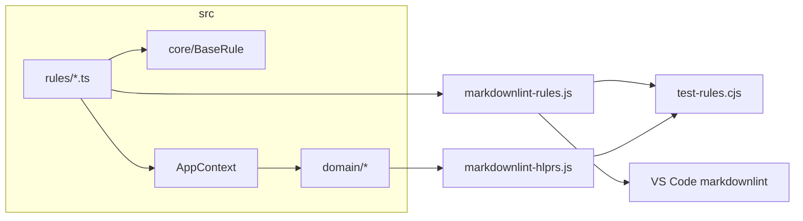

# markdownlint-custom

Кастомные правила [markdownlint](https://github.com/DavidAnson/markdownlint) для проверки Markdown в VS Code (расширение **Markdown All in One** или другое с поддержкой `markdownlint.customRules`).

Исходники — TypeScript в [`src/`](src/); runtime для markdownlint — CommonJS [`.js`](markdownlint-rules.js) в корне репозитория. Entry point: [`markdownlint-rules.js`](markdownlint-rules.js).

## Требования

- Node.js ≥ 20 (рекомендуется 22 LTS; версия в [`.nvmrc`](.nvmrc)) и npm
- VS Code + расширение с поддержкой `markdownlint.customRules`
- [`.editorconfig`](.editorconfig) — единый LF и отступ 4 пробела в редакторах с поддержкой EditorConfig

## Переносы строк (LF)

Репозиторий и рабочие копии — LF ([`.gitattributes`](.gitattributes), [`.editorconfig`](.editorconfig)). Это важно для regex-правил markdownlint и примеров в [`markdownlint-examples/`](markdownlint-examples/).

**Windows:** рекомендуется `git config core.autocrlf false` (глобально или локально для репозитория), чтобы Git не конвертировал LF↔CRLF поверх `.gitattributes` и не создавал шум в `git diff`.

VS Code: `"files.eol": "\n"` в `.vscode/settings.json` (локально; каталог `.vscode/` в [`.gitignore`](.gitignore)).

## Быстрый старт

```bash
npm install
npm test        # pretest → build, test-rules.cjs + check-function-order
```

## Подключение в VS Code

Фрагмент для `.vscode/settings.json` (путь к правилам — относительно workspace):

```json
{
  "markdownlint.customRules": ["./markdownlint-rules.js"],
  "markdownlint.config": {
    "default": false,
    "minimum-h2-heading": true,
    "list-items-end-with-semicolon-or-colon": true,
    "list-blank-line-spacing": true,
    "list-preceded-by-colon": true,
    "codeblock-preceded-by-colon": true,
    "no-leading-spaces": true,
    "sentences-end-with-mark": true
  }
}
```

Имена правил (`names`) — в [`src/markdownlint-rules.ts`](src/markdownlint-rules.ts) и в описаниях правил в IDE после сборки. Включайте только нужные: `"default": false` отключает built-in правила markdownlint.

## Правила проверки

Кастомные правила markdownlint для оформления Markdown-документов. Примеры нарушений и исправлений — в [`markdownlint-examples/<rule-name>/`](markdownlint-examples/).

| `names` | Что проверяет |
|---------|---------------|
| `minimum-h2-heading` | В документе есть хотя бы один заголовок H2 (`##`) вне code fence |
| `list-items-end-with-semicolon-or-colon` | Пункт списка (num/bul, вложенные) заканчивается `;`; перед блоком кода или прямым дочерним подпунктом — `:` |
| `list-blank-line-spacing` | Нумерованные списки: пустая строка до первого и после последнего пункта блока, единообразно между соседними num-пунктами (включая поднумерацию `1.1`, `1.1.1`); маркированные: пустая строка только до/после блока |
| `list-preceded-by-colon` | Обычный текст перед первым пунктом блока списка верхнего уровня заканчивается `:`; вложенные пункты и строки-заголовки не проверяются |
| `codeblock-preceded-by-colon` | Строка перед открывающей `` ``` `` (не пункт списка) заканчивается `:` |
| `no-leading-spaces` | Нет ведущих пробелов у обычного текста, пунктов списка верхнего уровня и строк `` ``` ``; у вложенных пунктов отступ допустим, если не меньше отступа предыдущего пункта |
| `sentences-end-with-mark` | Обычный текст (не заголовок, не пункт списка) заканчивается `.`, `!`, `?`, `:` или `;` |

Проверки выполняются вне содержимого code fence, кроме строк-обозначений `` ``` `` (для `no-leading-spaces`).

## Структура репозитория

| Путь | Назначение |
|------|------------|
| [`src/`](src/) | Исходники TypeScript (`core/`, `domain/`, `composition/`, `rules/`) |
| Корневые `*.js`, `core/`, `domain/`, `composition/`, `rules/` | **Артефакты tsc** — коммитить вместе с `src/` |
| [`markdownlint-examples/`](markdownlint-examples/) | Пары `_err.md` / `_suc.md` на каждое правило |
| [`test-rules.cjs`](test-rules.cjs), [`check-function-order.cjs`](check-function-order.cjs) | Тесты и проверка порядка функций |
| [`.cursor/rules/`](.cursor/rules/) | Правила Cursor; каталог — [`AGENTS.md`](AGENTS.md) |
| `.gitignore`, `.gitattributes`, `.editorconfig`, `.nvmrc`, `.npmrc` | Git, EditorConfig, Node/npm (подробнее в `.mdc`) |
| [`AGENTS.md`](AGENTS.md) | Краткий справочник для AI-агента |

Подробная структура — [`.cursor/rules/markdownlint-project.mdc`](.cursor/rules/markdownlint-project.mdc).

## Архитектура

Каждое правило — класс `XxxRule extends BaseRule`: метод `check()` вызывает domain-сервисы и сообщает нарушения через `onError`; `toRule()` адаптирует класс к API markdownlint.

Зависимости (парсер списков, обход code fence, checker-ы) собираются в [`AppContext`](src/composition/app-context.ts). [`markdownlint-rules.ts`](src/markdownlint-rules.ts) регистрирует все правила; [`markdownlint-hlprs.js`](markdownlint-hlprs.js) — compat-слой для [`test-rules.cjs`](test-rules.cjs).



## npm-скрипты

| Скрипт | Действие |
|--------|----------|
| `npm run build` | `tsc`: `src/` → корень |
| `npm test` | `pretest` (build) + `test-rules.cjs` + `check-function-order.cjs` |
| `npm run check` | `tsc --noEmit`, `node --check` артефактов, порядок функций (**без** пересборки) |
| `npm run check:order` | Только проверка порядка функций |

## Разработка и тестирование

Workflow — [`AGENTS.md`](AGENTS.md) (шаги 1–8). Кратко: правки → `npm test` → sync docs по [`.cursor/rules/docs-consistency.mdc`](.cursor/rules/docs-consistency.mdc).

Runtime — CommonJS `.js`, не `.ts` и не ESM.

## Связанная документация

- [`.cursor/rules/markdownlint-project.mdc`](.cursor/rules/markdownlint-project.mdc) — полные политики lint-правил, конвенции примеров, API hlprs
- [markdownlint: Custom Rules](https://github.com/DavidAnson/markdownlint/blob/main/doc/CustomRules.md) — официальная документация
